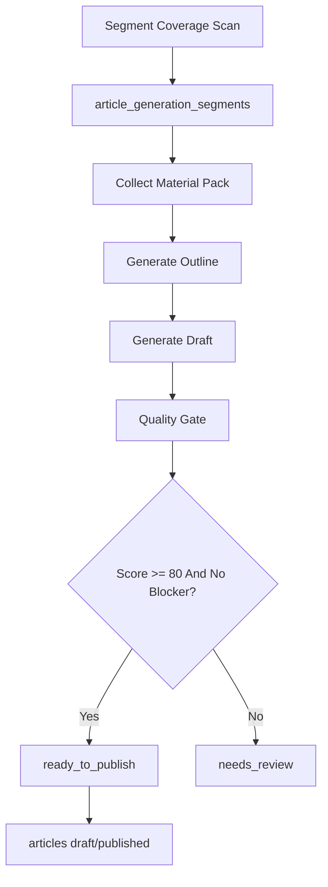

# AI Article Generation Pipeline

## Goal

ワンスポまとめを、AIに丸投げせず「AI編集部」として量産する。  
地域セグメント不足を検知し、素材を集め、AIで構成と本文を作り、品質ゲートを通して `draft` または `published` に振り分ける。

## Pipeline



## Segment Strategy

記事の単位は以下を基本にする。

- `municipality`: 市区町村単位。例: `世田谷区 × ドッグラン × 大型犬可`
- `walk_area`: 散歩エリア単位。例: `吉祥寺 × 雨の日 × 犬同伴カフェ`
- `prefecture`: 県単位の不足フォールバック。例: `神奈川県 × 犬と泊まれる`
- `region/national`: 記事不足時の広域フォールバック。

優先度は以下で決める。

- ユーザー登録散歩エリアが多い
- アプリ内検索/閲覧が多いテーマ
- 既存記事が少ない
- スポット候補が3件以上ある
- 季節性がある。例: 雨の日、真夏の避暑、冬の屋内

## Material Pack

AIに渡す前に、必ず構造化した素材パックを作る。

```json
{
  "segment": {
    "prefecture": "東京都",
    "municipality": "世田谷区",
    "walkAreaTag": "世田谷区",
    "dogSizeTag": "大型犬",
    "topicTag": "ドッグラン"
  },
  "spots": [
    {
      "name": "Example Dog Run",
      "placeId": "ChIJ...",
      "prefecture": "東京都",
      "municipality": "世田谷区",
      "facts": ["ドッグラン", "駐車場あり", "公式サイト要確認"],
      "sourceConfidence": 82
    }
  ],
  "sourceCount": 5,
  "officialSourceCount": 2
}
```

## Generation Steps

1. `article_generation_segments` から `missing` または `queued` を優先度順に取る。
2. 対象セグメントの候補スポットを `spots` から取得する。
3. Place Details / 公式サイト / ユーザー投稿 / manual_note を素材ソースとして `article_generation_sources` に保存する。
4. AIでまずアウトラインだけ作る。
5. アウトラインが地域・犬サイズ・テーマと合っていれば本文を生成する。
6. `evaluateGeneratedArticleQuality()` を実行する。
7. `score >= 80` かつ blockerなしなら `ready_to_publish`。それ以外は `needs_review`。
8. 自動公開は初期OFF。安定後に `score >= 90` かつ officialSourceCount >= 2 の記事だけ自動公開候補にする。

## Quality Gate

実装: `lib/articles/generation-quality.ts`

重視する項目:

- 実在 `place_id` 付きスポットが3件以上ある
- 対象エリアからスポットが外れていない
- タイトル/本文/セグメント列に地域・テーマ・犬サイズが入っている
- 犬同伴条件を断定しすぎない
- 飼い主が何を確認し、どう判断するかが書かれている
- 同伴条件、公式確認、暑さ/雨/路面/リードなどの安全注意がある

初期ルール:

- `score >= 80` and blockerなし: 公開候補
- `score >= 90` and officialSourceCount >= 2: 将来的な自動公開候補
- blockerあり: 必ず人間レビュー

## Suggested Backend Endpoints

バックエンドリポジトリ側に実装する想定。

- `POST /api/cron/articles/scan-segments`
  - 散歩エリア、既存記事、スポット数から不足セグメントを更新する。
- `POST /api/cron/articles/generate`
  - `queued` jobを素材収集から品質ゲートまで進める。
- `POST /api/admin/articles/generate`
  - 管理画面から特定セグメントを手動生成する。
- `GET /api/admin/articles/generation-jobs`
  - `needs_review` / `ready_to_publish` を一覧する。

## Rollout

### Week 1

- DB migration適用
- segment scanの実装
- 素材パック生成の実装
- 品質ゲートをbackendへ移植

### Week 2

- AIアウトライン/本文生成
- draft保存
- 管理画面で `needs_review` を確認
- 20〜30本を生成して品質を調整

### Week 3-4

- 優先エリアを東京/神奈川/大阪/埼玉/千葉に拡大
- 週20〜50本生成
- `score >= 90` の自動公開候補を検証

### After Month 2

- 月100本規模まで拡張
- 低カバレッジ地域を自動で埋める
- 季節記事、雨の日記事、大型犬可記事を継続生成

## Cost Model

AI生成そのものは安い。費用を左右するのは根拠ソース収集と人間レビュー。

- AI下書き: 1本 数十円〜数百円
- Places/公式情報確認: 1本 数十円〜数百円
- 人間レビュー: 1本 数百円〜1,500円
- 初期50本: 約5万〜15万円
- 月100本運用: 約10万〜30万円

自動公開率を上げるほど人間レビュー費は下がるが、誤情報リスクは上がる。初期は `draft + 人間確認` を推奨。

## Guardrails

- 犬同伴条件、大型犬可、室内可、ワクチン要否は断定しない。
- 「来店前に公式情報を確認」を自然に入れる。
- `__FILL_` place_idの記事は公開不可。
- 公式サイトやPlacesで根拠が弱い場合は `needs_review`。
- 既存記事とタイトル/スポット構成が近い場合は重複候補として止める。
