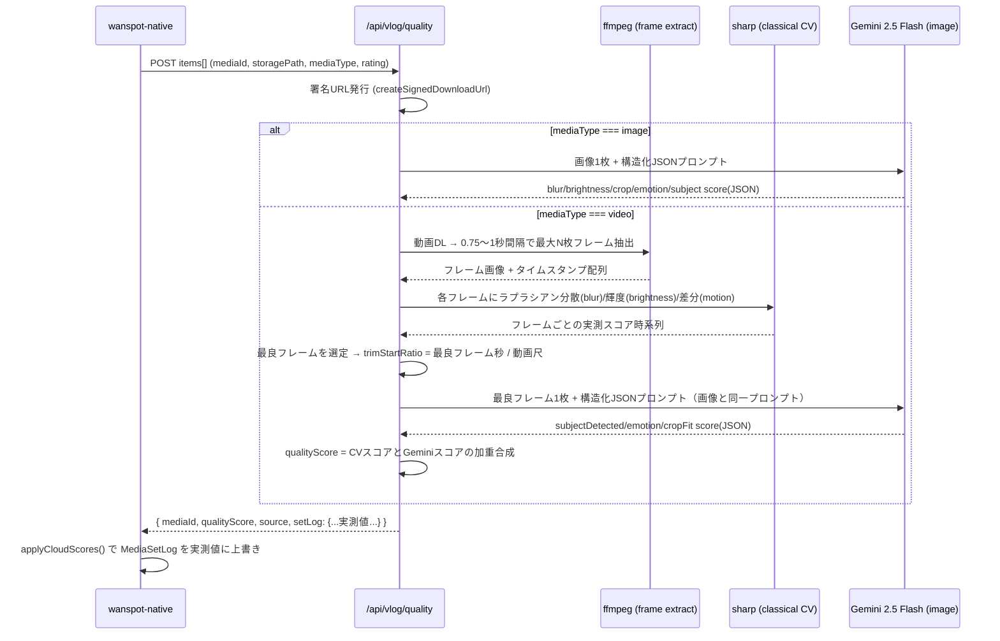
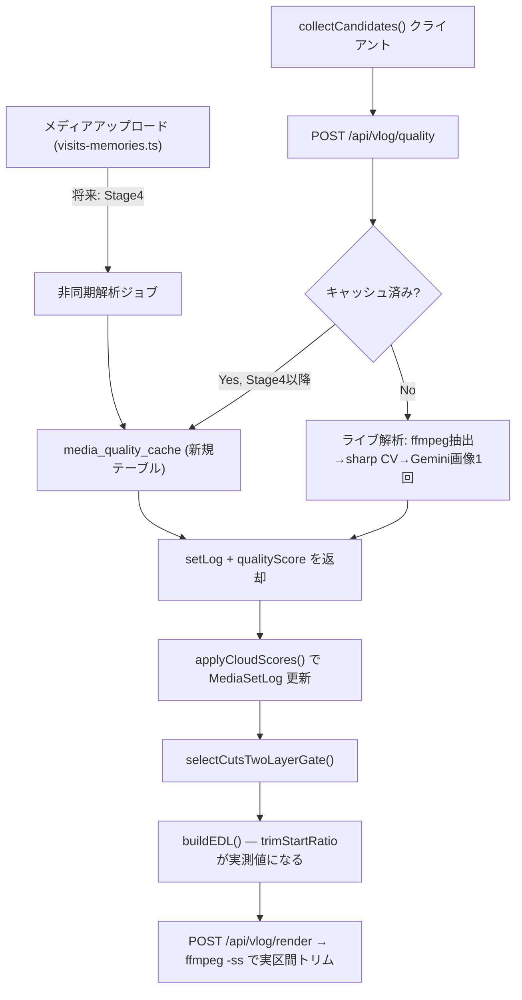

# Vlog動画品質解析強化 設計ドキュメント（実CV解析導入）

> ステータス: **設計レビュー中 — 未実装**
> 対象: `wanspot-native`（クライアント）/ `wanspot`（サーバー）
> 前提: Set log（`lib/vlog/set-log.ts`）導入後の次フェーズ。今回のドキュメントはコード変更を含まない。

## Goal

現在のVlog自動生成は「どの素材を使うか」「どこから使うか」の判断材料（Set log / `qualityScore`）が **実際の画像・動画の中身を一切見ていない疑似値** で構成されている。特に動画はヒューリスティックのみで、コメントにも「動画素材は現状ヒューリスティック評価」と明記されている状態。
本ドキュメントは、動画（および画像の一部指標）を実際に解析して本物のスコアに置き換えるための調査・技術選定・移行計画をまとめる。

---

## 1. 現状の限界

### 1.1 Set logは何も解析していない

`buildMediaSetLog()`（`lib/vlog/set-log.ts`）の実体は、`mediaId` 文字列を31進ハッシュして0–1の疑似乱数を作るだけの関数。

```ts
function hashUnit(seed: string): number {
  let h = 0
  for (let i = 0; i < seed.length; i++) h = (h * 31 + seed.charCodeAt(i)) >>> 0
  return (h % 1000) / 1000
}
```

これを元に、`motionScore` / `blurScore` / `brightnessScore` / `cropFitScore` / `emotionScore` / `trimStartRatio` を「それっぽい範囲」に収めているだけで、以下は一切見ていない：

- 画像・動画の実ピクセル（明るさ・ブレ・被写体）
- 動画のどの区間が良いか（`trimStartRatio` は `mediaId` のハッシュに `0.08〜0.22` を掛けているだけ）
- 犬（被写体）が実際に写っているか
- 音声・画角・手ブレの実測値

同じ `mediaId` なら常に同じ値が出るため「一貫性はあるが、内容と無関係」という状態。qualityScore自体も、動画は `scoreMediaHeuristic()`（`wanspot/src/lib/vlog/quality-score.ts`）で `base(0.52) + jitter*0.28 + ratingBoost` という完全ヒューリスティックであり、画像のみGemini Visionによる実解析（`scoreMediaCloud`）が入っている。

### 1.2 動画特有の問題（現状ケアされていない）

| 問題 | 現状の扱い | 実際に必要なこと |
|---|---|---|
| 手ブレ・カメラの構えブレ | 未検知。`trimStartRatio`はハッシュ由来で無関係 | フレーム単位でブレ量を測り、安定した区間を選ぶ |
| 暗さ・逆光 | 未検知 | 明るさのヒストグラム解析 |
| 被写体（犬）が写っていない | 未検知。ただの「ドッグVLOG」前提で採用してしまう | 被写体検出（犬/人/シーン） |
| どの区間が一番良いか分からない | `trimStartRatio`は「冒頭の構えを避ける」という**固定の経験則**をハッシュで揺らしただけ | 実際に一番ブレが少なく被写体が見える区間を検出 |
| 音声（風切り音・無音） | 未対応（画角のみ想定） | 将来的にはオプション。今回は画角中心 |
| レンダー時の信頼度 | `render-edl.ts`は`trimStartRatio`を素直に信頼してffmpegでトリムするが、その値自体が疑似値 | 値の出自を実解析に置き換えれば、既存のトリム機構はそのまま活きる |

つまり **「値を受け渡す配管（Set log→EDL→ffmpegトリム）」は既にできている**。今回強化すべきは「配管に流す値の出自」であり、大規模なアーキテクチャ変更ではない。

### 1.3 副次的に見つかった既存の問題（本タスクのスコープ外だが記録）

- `wanspot/src/lib/vlog/quality-score.ts` は `gemini-2.0-flash` を使用しているが、**このモデルは2026年6月1日付でdiscontinued（提供終了）**（Google公式ドキュメント確認）。現状は例外がcatchされ`heuristic`にフォールバックしているため画像側も実質フォールバック挙動になっている可能性が高い。動画対応に着手する前に、まずこのモデルIDの更新（`gemini-2.5-flash` 等）が必要。
- `visits-memories.ts` の `MemoryRow` には動画の `duration`（尺）や `width/height` を保存するカラムが存在しない。サーバー側は `render-edl.ts` の `getMediaDurationSec()` のように `ffmpeg -i` の stderr をパースして尺を取得している（ffprobe相当の代用）。動画解析を追加するなら同じ代用手段が使えるが、アップロード時にメタデータを保存しておくと解析コスト・レイテンシを削減できる（§6 Stage 4以降で言及）。
- `attachSignedUrls()` は動画に `thumbnail_url` が無い場合、`thumbSignedUrl` に動画ファイル自体のURLをそのまま入れている（実質サムネイル画像が存在しない）。今回のフレーム抽出処理で得られる「ベストフレーム」は、この動画サムネイル問題の解決にも転用できる（§3.5 補足）。

---

## 2. 技術選択肢の比較

### a) Gemini Vision 動画直接入力（サーバー側、動画ファイルをそのままモデルに渡す）

現行の画像解析（`scoreMediaCloud`）を動画にも拡張する方式。

- **実現方法**: 署名URLからダウンロード → base64化 → `inlineData`として動画バイトを渡す（or File API）。プロンプトで「一番良い区間の開始秒」「被写体の有無」等を含むJSONを返させる。
- **サイズ/尺の制限**: Inline Dataは **100MB未満・1分未満推奨**。File API（20GB/2GB）を使えば長尺もOKだが、アップロード→`ACTIVE`状態待ちのポーリングが必要になり実装・レイテンシが増える。アプリ側の動画選択は `videoMaxDuration: 120`（2分）で制限されているため、Inline Dataの推奨枠を超えるケースが一定数出る可能性がある。
- **推論コスト**: Gemini 2.5 Flashで動画は「1秒 ≈ 258〜263トークン（デフォルト解像度）」。10秒クリップなら約2,600トークン、入力$0.30/M換算で**1クリップ約$0.0008**。動画の長さに比例してコスト・レイテンシが増える。
- **レイテンシ**: 動画のダウンロード＋base64エンコード＋アップロード＋Gemini推論。実測は変動するが、短尺クリップでも数秒〜10秒超、File API経由やクリップが長い場合はさらに伸びる。**クリップ尺に比例して線形に増える**のが最大の弱点。
- **精度**: Geminiは1fpsサンプリングのため、細かい手ブレ（1秒未満の揺れ）を捉えにくい。「ブレている/いない」を言語化させる形になり、既存の`scoreMediaCloud`同様スコアのパース失敗・キャリブレーションドリフトのリスクを引き継ぐ。
- **実装難易度**: 中。既存の画像解析コードとほぼ同じ形で書けるが、File API分岐・タイムアウト設計が新規に必要。

### b) サーバーffmpegでフレーム抽出 → 既存Gemini画像解析に一括投入

- **実現方法**: `render-edl.ts` で既に使っている `ffmpeg-static` を使い、0.5〜1秒間隔でJPEGフレームを抽出。抽出フレームを既存の画像プロンプトへ複数`inlineData`として1リクエストにまとめて渡し、フレームごとのスコア配列をJSONで返させる。
- **コスト**: フレーム1枚 ≈ 258トークン（高解像度指定時は最大1120）。10秒クリップを0.5秒間隔で抽出→20フレーム ≈ 5,160〜22,400トークン。動画を直接渡す(a)とほぼ同等かやや割高（フレームを画像として個別トークン化するため）。
- **レイテンシ**: フレーム抽出はローカルCPU処理でサブ秒〜数秒（クリップ尺・フレーム数に依存）。Gemini呼び出しは1回にまとめられるため往復回数は増えないが、リクエストサイズが大きくなるほど推論レイテンシは伸びる。
- **精度**: フレーム単位の時系列スコアが得られるため「どの区間が一番良いか」を**アルゴリズム側で決定できる**（LLMにタイムスタンプを言わせるより決定的で検証しやすい）。ただしブレ/明るさの判定自体は依然LLMの主観的判断に依存。
- **実装難易度**: 中〜高。フレーム抽出パイプライン（一時ファイル管理、抽出数の上限制御）を新規に作る必要がある。ただし`render-edl.ts`のワークディレクトリ管理・ffmpeg実行パターンをそのまま流用できる。

### c) 軽量古典CV（sharp等）＋ 既存Gemini画像解析のハイブリッド（推奨）

- **実現方法**: (b)と同じくffmpegで数フレーム抽出。抽出したフレームに対し、AI APIを使わず`sharp`でラプラシアン分散（ブレ検出）・ヒストグラム輝度（明るさ検出）・フレーム間差分（motion/安定度）を計算。最もスコアの良いフレームだけを既存の`scoreMediaCloud`（画像用Gemini呼び出し）にかけて被写体（犬）検出・感情・構図を判定。
- **コスト**: 古典CV部分はAI API呼び出しゼロ（無料・ローカルCPU）。動画1本あたりGemini呼び出しは**画像1枚分だけ**（既存の画像コストと同額、約$0.0004/本）。(a)(b)より1桁近く安い。
- **レイテンシ**: フレーム抽出（ffmpeg, サブ秒〜数秒）＋ sharp解析（フレームあたり数十〜数百ms、無視できるレベル）＋ Gemini画像呼び出し1回（既存の画像フローと同じレイテンシ）。動画尺が長くても**抽出フレーム数の上限で頭打ちにできる**ため、レイテンシが動画尺に比例して伸びない。
- **精度**: ブレ・明るさは「ラプラシアン分散」「輝度ヒストグラム」という確立された古典的CV手法で、LLMに言語化させるより**決定的・再現性が高い**（同じ入力なら同じ値になり、キャリブレーションもしやすい）。被写体検出・感情・構図といった意味理解が必要な部分は、既に実運用しているGemini画像プロンプトをそのまま転用できるため新規のAI精度リスクを最小化できる。
- **実装難易度**: 中。新規依存として`sharp`が必要（サーバーレス環境でのネイティブバイナリ互換性を要検証、§7参照）。フレーム抽出は(b)と共通。

### d) その他の選択肢（検討したが非推奨）

- **クライアント（React Native）側での事前CV解析**: `expo-video`のメタデータ取得や、フレームサンプリング＋WASM/JSでの簡易ブレ検出をアップロード前に行う案。サーバー往復が減りコストは下がるが、①端末CPU/バッテリー負荷、②Android/iOS間の計算結果ブレ、③スコアリングロジックをアプリ更新なしで調整できない（現状の「サーバー側で一元管理」という設計思想に反する）というデメリットが大きく、今回は非推奨。将来的な最適化案として§6 Stage 5で軽く触れる。
- **専用の動画/画像品質解析SaaS（AWS Rekognition Video, Cloud Video Intelligence等）**: 新規ベンダー・新規コスト体系・新規認証を抱えることになり、既にGemini Visionに投資済みの現行アーキテクチャとの整合性が低い。非推奨。

### 比較まとめ

| 選択肢 | 実装難易度 | AIコスト/本(動画) | レイテンシ特性 | 精度 |
|---|---|---|---|---|
| a) Gemini動画直接 | 中 | 約$0.0007〜（尺に比例) | 尺に比例して線形増加 | LLM主観、1fps粗さ |
| b) フレーム抽出→Gemini画像一括 | 中〜高 | 約$0.001〜0.005 | 抽出数に比例（頭打ち可） | 時系列で区間選定は決定的、ブレ判定はLLM主観 |
| c) 古典CV＋Gemini画像1回（推奨） | 中 | 約$0.0004（既存画像と同額） | 抽出数上限で頭打ち、AI呼び出しは1回のみ | ブレ/明るさは決定的で再現性高、意味理解は実績あるGemini画像プロンプト流用 |

### 推奨: c) 古典CV（sharp）＋ 既存Gemini画像解析のハイブリッド

理由:

1. **コストが最も低く予測可能** — 動画1本あたりのAI呼び出しが画像1枚と同じ（既存コストモデルを壊さない）。
2. **レイテンシが動画尺に依存しない** — 抽出フレーム数の上限で頭打ちにできるため、`videoMaxDuration: 120`（2分の動画）を選んでも解析コスト・時間が線形に爆発しない。
3. **ブレ/明るさが決定的で検証可能** — 「LLMにブレ具合を言語化させる」より、ラプラシアン分散・輝度ヒストグラムという古典的手法の方が再現性・キャリブレーションのしやすさで優れる。既存コードの`calibrateQualityYield()`のようなキャリブレーション手法とも相性が良い。
4. **既存資産をほぼ全て再利用** — ffmpeg実行パターンは`render-edl.ts`から、被写体/感情/構図判定は`scoreMediaCloud`からそのまま転用でき、新規のAI精度リスクを増やさない。
5. **段階的に導入しやすい** — 古典CV部分だけを先に入れて検証し、AI呼び出し追加を後回しにできる（§6）。

---

## 3. Before/After

### 3.1 Before: 現状のコード動作

`buildMediaSetLog()` の動作（`lib/vlog/set-log.ts`）:

```ts
export function buildMediaSetLog(input: {
  mediaId: string
  mediaType: 'image' | 'video'
  qualityScore: number
  rating: number | null
  hasDiary: boolean
}): MediaSetLog {
  // mediaId のハッシュ値のみを使って blur/motion/crop/emotion を「それっぽく」生成
  // trimStartRatio も mediaId ハッシュ由来（実尺・実ピクセルは無関係）
}
```

- クライアントが `collectCandidates()` でローカル素材を集める → `scoreMediaHeuristic()` が `qualityScore` を（動画は完全ヒューリスティック、画像はクラウドスコア差し替え前提で）計算 → `buildMediaSetLog()` が疑似メタデータを付与。
- `selectCutsTwoLayerGate()` はこの疑似 `rankScore` でカットを選ぶ。
- `buildEDL()` は疑似 `trimStartRatio` をそのままEDLに書き込む。
- サーバー `render-edl.ts` はEDLの `trimStartRatio` を無条件に信頼してffmpegの `-ss` オプションに渡す。

つまり **「トリム位置を指定する仕組み」自体は既に完成しており、値の出自だけが偽物**。

### 3.2 After: 実データフロー（ステップバイステップ）

タイミングは2箇所に分けて考える。

**(A) Vlog生成リクエスト時（既存の`/api/vlog/quality`呼び出しを拡張・当面のメイン導線）**



**(B) アップロード直後（将来: 非同期プリコンピュート、§6 Stage 4）**

アップロード完了イベントをトリガに同じ解析を裏側で実行し、結果を `memories` テーブルや専用キャッシュテーブルに保存。Vlog生成時は基本キャッシュを読むだけにして、生成時のレイテンシから解析処理そのものを切り離す。

### 3.3 `trimStartRatio` の仕組みの変化

- **Before**: `mediaId` を文字列ハッシュ → `0.08〜0.22` の範囲に押し込むだけ。内容と無関係。
- **After**: フレーム抽出で得た各フレームの実測 `blurScore`/`brightnessScore`/`motionScore` を合成した「フレーム品質スコア」の時系列から最良フレームの位置（秒）を求め、`trimStartRatio = 最良フレーム秒 / 動画尺` として算出。動画尺は既存の `getMediaDurationSec()`（`render-edl.ts` にある ffmpeg stderr パース方式）を流用するか、アップロード時にメタデータとして保存した値を使う。
- レンダー側（`render-edl.ts` の `resolveVideoTrimStartSec()`）は**変更不要**。既に「EDLのtrimStartRatioを実尺に当てはめてclampする」処理があるため、値の出自が実解析に変わるだけで恩恵をそのまま受けられる。

### 3.4 各スコアの実解析ロジック

| フィールド | Before（疑似） | After（実解析） |
|---|---|---|
| `motionScore` | ハッシュ×係数 | 抽出フレーム間のピクセル差分（フレーム間絶対差の平均）を正規化。差分が大きすぎる（＝手ブレ）場合は低スコア、ある程度の動き（犬が走っている等）は許容範囲としてキャリブレーション |
| `blurScore` | `qualityScore*0.7 + ハッシュ*0.3` | 各フレームにラプラシアンカーネルで畳み込み、その分散を計測（ラプラシアン分散が低い＝ブレている）。sharpの`.convolve()`＋分散計算で実装 |
| `brightnessScore` | `qualityScore*0.6 + ハッシュ*0.4` | sharpの`.stats()`でチャンネル別ヒストグラム平均輝度を取得し、暗すぎ・明るすぎ（白飛び）両方をペナルティとして0-1化 |
| `cropFitScore` | ハッシュ×係数 | 最良フレームをGemini画像プロンプトに渡し「被写体が9:16フレーム内でどう収まっているか」を構造化スコアとして取得（既存の`smartCrop: 'dog_center_9_16'`前提と整合させる） |
| `emotionScore` | `hasDiary`/`rating`ブースト＋ハッシュ | 最良フレームをGeminiに渡し「印象的な瞬間か（表情・仕草・状況）」を構造化スコアとして取得。日記文言・評価によるブーストは既存ロジックを維持しつつ、実解析スコアと合成 |
| 犬（被写体）検出 | 未実装 | Geminiプロンプトに`subjectDetected: boolean`（犬または人が視認できるか）を追加。`false`の場合はcropFit/emotionに強いペナルティを掛け、層1救済カットの判断材料にも使う |

### 3.5 補足: 動画サムネイルとの統合

フレーム抽出で得られる「最良フレーム」は、`visits-memories.ts` の `thumbnail_url` が未設定の動画に対する**実サムネイル画像**としても再利用できる。今回のスコープには含めないが、解析時に生成した最良フレームをStorageにアップロードして`memories.thumbnail_url`を埋める案は、別チケットとして提案する価値がある副産物。

---

## 4. API/スキーマ変更案

### 4.1 `/api/vlog/quality` レスポンス拡張

現状のレスポンス（`wanspot/src/app/api/vlog/quality/route.ts`）:

```json
{ "mediaId": "...", "qualityScore": 0.71, "source": "cloud", "advice": { "...": "..." } }
```

拡張案（後方互換: 既存フィールドは維持し、`setLog`を追加）:

```json
{
  "mediaId": "...",
  "qualityScore": 0.71,
  "source": "cloud_video_cv" ,
  "advice": { "band": "usable", "warnings": [], "suggestions": [], "setlogHints": [] },
  "setLog": {
    "motionScore": 0.62,
    "blurScore": 0.81,
    "brightnessScore": 0.58,
    "cropFitScore": 0.66,
    "emotionScore": 0.74,
    "trimStartRatio": 0.34,
    "subjectDetected": true,
    "analysisSource": "cv_hybrid"
  }
}
```

- `source` は既存の `'cloud' | 'heuristic' | 'rejected'` に加えて、動画解析経路を区別できる値（例: `'cloud_video_cv'`, `'cloud_image'`）を追加し、観測性を高める。
- `setLog` は省略可能（`optional`）にし、返らない場合はクライアント側が既存の `buildMediaSetLog()`（ヒューリスティック）にフォールバックする現行動作を維持。

### 4.2 型定義の変更

**サーバー `VlogQualityItem`（`wanspot/src/lib/vlog/schemas.ts`）**: 大きな変更は不要。将来的にクライアントが動画の尺を保持していれば`durationSec`を任意項目として追加できる（サーバー側の`getMediaDurationSec()`呼び出しを省略できてレイテンシが下がる）。

```ts
export const vlogQualityItemSchema = z.object({
  mediaId: z.string().uuid(),
  storagePath: z.string().min(1).max(512),
  mediaType: z.enum(['image', 'video']),
  rating: z.number().min(1).max(5).nullable().optional(),
  durationSec: z.number().positive().max(180).nullable().optional(), // 追加（任意）
})
```

**クライアント `MediaSetLog`（`lib/vlog/set-log.ts`）**: フィールド自体は変えず、`subjectDetected`・`analysisSource`を追加。

```ts
export type MediaSetLog = {
  motionScore: number
  blurScore: number
  brightnessScore: number
  cropFitScore: number
  emotionScore: number
  rankScore: number
  trimStartRatio: number | null
  subjectDetected: boolean | null   // 追加
  analysisSource: 'cv_hybrid' | 'cloud_image' | 'heuristic'  // 追加（観測性）
}
```

`buildMediaSetLog()` 自体は**削除しない**。クラウド解析が失敗・タイムアウトした場合のフォールバック生成器として現状のまま残す（`analysisSource: 'heuristic'`を付けて返す）。

### 4.3 クライアント側のマージ処理

`lib/vlog/quality-client.ts` の `fetchCloudQualityScores()` はレスポンスから `qualityScore` のみを `Map<string, number>` として返しているが、`setLog` も同様に返すよう拡張し、`lib/vlog/build-payload.ts` の `applyCloudScores()` で `candidate.setLog` をサーバー実測値に丸ごと置き換える（現状は `qualityScore` のみ置換）。

```ts
// quality-client.ts
export type CloudQualityResult = {
  mediaId: string
  qualityScore: number
  source: string
  setLog?: Partial<MediaSetLog>  // 追加
}

// build-payload.ts の applyCloudScores 相当
return candidates.map((c) => {
  const cloud = scores.get(c.id)
  if (!cloud) return c
  return {
    ...c,
    qualityScore: cloud.qualityScore,
    setLog: cloud.setLog ? { ...c.setLog, ...cloud.setLog } : c.setLog,
  }
})
```

### 4.4 データフロー図（全体）



---

## 5. コスト・レイテンシ試算

### 5.1 前提（仮置き）

- 月間Vlog生成数: **1,000本**
- 1本あたり平均素材数: **5点**（画像60% / 動画40%と仮定 → 月3,000画像・2,000動画）
- 動画1本の平均尺: **8〜10秒**（アプリの動画選択上限は `videoMaxDuration: 120` = 2分だが、実際の「思い出」記録クリップは短尺が主体と想定。実測値は現在保存されていないため要検証、§7で計測タスク化）
- モデル: `gemini-2.5-flash`（`gemini-2.0-flash` は2026-06-01でdiscontinuedのため移行必須）。入力 $0.30/M tokens、出力 $2.50/M tokens（2026年6月時点のGemini公式価格）

### 5.2 選択肢別コスト（月間、AI API費用のみ）

| 選択肢 | 動画1本あたりトークン(概算) | 動画1本あたり費用 | 月2,000本の動画費用 | 画像側費用(月3,000枚) | 合計/月 |
|---|---|---|---|---|---|
| a) 動画直接入力 | 約2,600 (9秒×263+プロンプト150) | 約$0.0008 | 約$1.6 | 約$1.2 | 約$2.8 |
| b) フレーム抽出→Gemini画像一括(0.5秒間隔,約18枚) | 約4,800〜20,000(解像度設定依存) | 約$0.0015〜0.006 | 約$3〜12 | 約$1.2 | 約$4.2〜13.2 |
| c) 古典CV＋Gemini画像1回（推奨） | 約1,270 (最良フレーム1枚のみ) | 約$0.0004 | 約$0.8 | 約$1.2 | 約$2.0 |

※ 上記はいずれも1,000〜2,000本/月規模では**すべて数ドル/月とAI費用そのものは僅少**。差が出るのはコストではなく後述のレイテンシ・予測可能性・精度。

### 5.3 レイテンシ試算（ユーザー体感への影響）

現状のVlog生成UXは `selecting…(≈1.8s) → connecting…(≈2.2s) → finishing…(≈1.6s)` の3段階演出（`render-client.ts`の`simulateVlogGenerationStages`）で、合計**約5.6秒の待機**を前提にしている。品質解析はこの前段（`selecting`相当）に挟まる想定。

| 選択肢 | 動画1本の解析レイテンシ(概算) | 5素材(混在)バッチでの合計への影響 |
|---|---|---|
| a) 動画直接入力 | DL+base64+推論で数秒〜10秒超。**尺に比例して線形増加**（120秒の動画なら大幅に悪化しうる） | `Promise.all`で並列化しても最も遅い1本がボトルネック。既存UXの5.6秒枠を容易に超過するリスク大 |
| b) フレーム抽出→Gemini画像一括 | 抽出(ローカル,1〜2秒)＋大きめリクエストの推論(数秒) | 尺が伸びてもフレーム数上限で頭打ちにできるが、bのままだと1リクエストが大きくなりやすい |
| c) 古典CV＋Gemini画像1回（推奨） | 抽出(1〜2秒)＋sharp解析(数百ms未満)＋Gemini画像1回(既存画像と同じ、1〜3秒) | 既存の画像解析と同程度のレイテンシに収まりやすく、UX枠内に収めやすい |

**結論**: (a)は動画の尺に比例してコスト・レイテンシが線形に伸びるため、`videoMaxDuration: 120`という現状のアプリ制約と相性が悪い。(c)は抽出フレーム数で頭打ちにできるため、動画尺に関わらずレイテンシが安定する。ただし本質的にはStage 4（非同期化・キャッシュ）まで進めない限り、どの案でも「初回解析時」はリクエスト時レイテンシに乗ることに留意（§6）。

---

## 6. 段階的ロールアウト案

一気に全部作り変えず、リスクの低い順に導入する。

### Stage 1: 画像スコアリングの土台修正（動画は未着手）

- `gemini-2.0-flash`（discontinued）→ `gemini-2.5-flash` へモデル移行。
- 画像プロンプトを「単一スカラー」から「構造化JSON（blur/brightness/cropFit/emotion/subjectDetected）」に変更し、`MediaSetLog`の各フィールドに実測値をそのまま反映（現状は`qualityScore`という1つの数字からヒューリスティックに逆算している）。
- 動画は現状通り完全ヒューリスティックのまま維持（変更範囲を画像のみに限定してリスクを分離）。
- 既存の`buildVlogQualityAdvice()`のバンド判定・warning文言は維持。

### Stage 2: 動画フレーム抽出＋古典CVの導入（AI呼び出しはまだ追加しない）

- `render-edl.ts`のffmpeg実行パターンを流用し、動画から最大N枚（例: 6〜8枚、0.75〜1秒間隔）のフレームを抽出。
- `sharp`を新規依存として追加し、ブレ（ラプラシアン分散）・明るさ（輝度ヒストグラム）・motion（フレーム間差分）を計測。
- 実際の動画サンプルで閾値をキャリブレーション（既存の`calibrateQualityYield()`と同様の手法で、人手ラベルとCVスコアの相関を確認してから本番の閾値を決める）。
- この時点では`qualityScore`自体はまだヒューリスティックのままでよい（Set logの一部フィールドだけを実測値に置き換えて影響範囲を限定）。

### Stage 3: 最良フレームへのGemini画像解析を統合

- Stage 2で選んだ最良フレームを、既存の`scoreMediaCloud`と同じ経路でGeminiに渡し、`subjectDetected`/`emotion`/`cropFit`を取得。
- CVスコアとGeminiスコアを合成して動画の`qualityScore`を算出。ここで初めて動画が「実解析」に切り替わる。
- フィーチャーフラグ（例: `VLOG_VIDEO_ANALYSIS_ENABLED`）で有効/無効を切り替え可能にし、段階的にロールアウト（例: 内部ユーザー→一部ユーザー→全体）。

### Stage 4: 非同期化・キャッシュ

- アップロード完了時に解析を非同期実行し、結果を`memories`拡張カラムまたは`media_quality_cache`テーブルに保存。
- `/api/vlog/quality`はキャッシュ優先で読み、未解析の場合のみライブ解析にフォールバック。
- これによりVlog生成時のレイテンシから解析処理そのものを実質除去できる。

### Stage 5: 精度チューニング・拡張

- 抽出フレーム数/fpsの調整、必要であれば音声解析（風切り音・無音検知）の追加検討。
- クライアント側での軽量事前フィルタ（極端に暗い/ブレた動画をアップロード前に警告する等）のUX検討。
- Set logの時系列データ（フレームごとのスコア）を編集者向けデバッグ画面で可視化し、継続的なキャリブレーションに使う。

---

## 7. リスクと対策

| リスク | 対策 |
|---|---|
| 解析失敗（ffmpeg/sharp/Gemini いずれかのエラー） | 各段階で既存パターン（`scoreMediaHeuristic`へのcatch-and-fallback）を維持・拡張。新規失敗点（フレーム抽出失敗、sharp例外）も同じフォールバックに集約し、Vlog生成自体は絶対にブロックしない |
| 処理時間超過 | `/api/vlog/quality`に`render/route.ts`同様の明示的`maxDuration`を設定。さらに現状`Promise.all`で全アイテムを並列処理しているが**アイテム単位のタイムアウトが無い**ため、1本の遅い動画が全体を止めるリスクがある（既存の潜在バグ）。`Promise.race`等でアイテム単位のタイムアウト→フォールバックを導入する |
| コスト超過 | 環境変数によるキルスイッチ（既存の`GEMINI_API_KEY`未設定時フォールバックと同様のパターンを`VLOG_VIDEO_ANALYSIS_ENABLED`等で明示化）。既存のレート制限（20req/60s、30件/payload）は維持し、動画が多いpayloadはさらに低い上限を検討 |
| `sharp`のサーバーレス互換性 | 導入前にデプロイ環境（Next.js on Vercel想定）でのネイティブバイナリ互換性を検証するスパイクタスクを設ける。`serverExternalPackages`設定やプラットフォーム別バイナリの確認が必要になる可能性がある |
| CV閾値のキャリブレーション誤り | Stage 2で実データを使ったキャリブレーション（`calibrateQualityYield`と同様の手法）を必須ステップとして、Stage 3以降に進める前にラベル付きサンプルで検証する |
| 動画尺データが未保存で毎回ffmpegで尺取得が必要 | 当面は`getMediaDurationSec()`の代用手段を使い続け、Stage 4のタイミングでアップロード時にメタデータ（尺・解像度）を保存するマイグレーションを検討 |
| 既存モデルID(`gemini-2.0-flash`)がdiscontinued | Stage 1着手前に必ず`gemini-2.5-flash`（またはそれ以降の現行モデル）へ移行。現状動作している「はず」の画像解析が実際には常にフォールバックしている可能性を先に確認する |

---

## Open Questions（次のレビューで確認したいこと）

1. 実際の動画クリップの尺分布（現状メタデータが無いため未知）。§5のコスト・レイテンシ試算の前提を実測値で補正する必要がある。
2. `sharp`のサーバーレス実行環境（Vercel Node.js Function）での動作検証は誰が/いつ行うか。
3. Stage 3以降のフィーチャーフラグ運用（誰が有効化判断をするか、ロールバック基準は何か）。
4. `subjectDetected: false`（犬が写っていない）の場合、層1救済カット・層2ゲートの挙動をどう変えるか（今回は「ペナルティを掛ける」方向性のみ提示、具体的な重み付けは実装フェーズで調整）。
